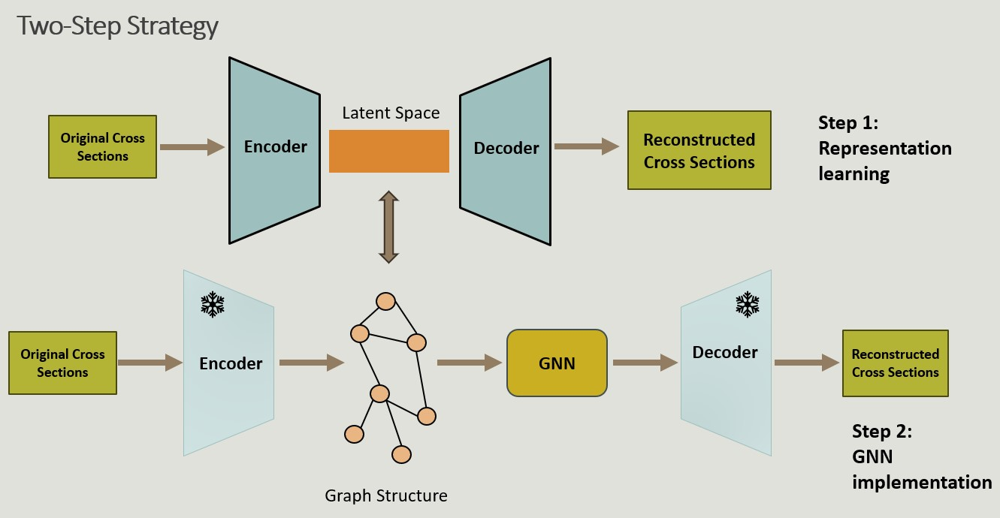
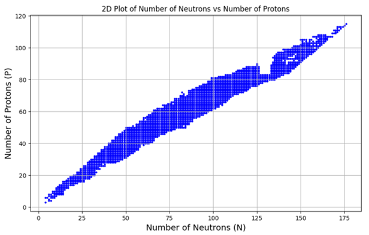
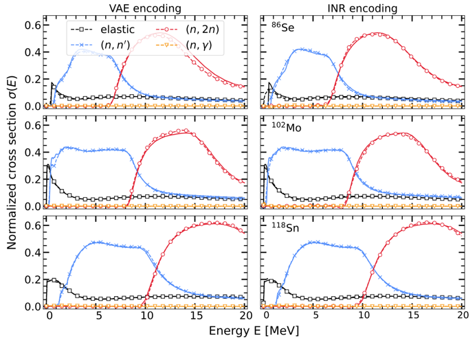
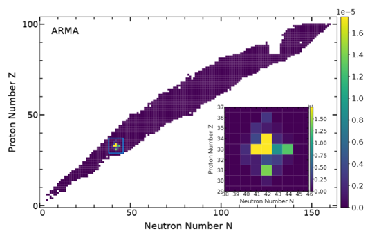
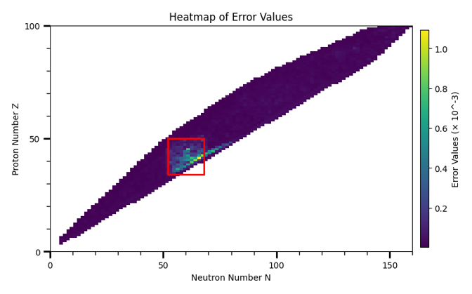

# Learning Nuclear Cross Sections Across The Chart Of Nuclides With Graph Neural Networks

## Project Overview

This project focuses on learning the chart of nuclear isotopes by enforcing a graph based structure in the latent space of popular encoding modules (VAE and INR). These latent embeddings are then leveraged for downstream nuclear cross-section ML tasks

Due to the proprietary nature of the dataset and collaboration agreements, the full codebase is private. This repository provides a high-level summary of the project’s objectives, methods, and outcomes.

Paper: [Link](https://arxiv.org/pdf/2404.02332)

## System Overview

## My Contributions

* Designed custom GNN architectures incorporating physical knowledge into graph structures.

* Implemented message-passing networks and tested aggregation schemes.

* Optimized model training for low-sample, high-variance scientific data.

* Analyzed model generalization across unseen material structures.

* Generalized results to predict unknown cross-sections and to complete the isotope chart

## Technical Stack

* Python
* PyTorch Geometric
* PyTorch
* NetworkX (for graph preprocessing)
* Scikit-learn (for evaluation and baseline models)

## Key Outcomes

* Introduced a pipeline for isotope prediction - novel contribution to this domain
* Demonstrated better generalization on unseen material classes using geometry-informed graph design.
* Highlighted the benefits of structure-aware modeling in nuclear material science applications.

## Results

1. Step 1 outcome: Below is the visualization of the embeded cross sections in the latent space of the encoding modules

2. Step 2 outcome:

* Reconstruction performance on test set (necessary to learn the underlying geometric dependencies)

  

* Uncertainty propagation for selected nucleus - a visualization of how perturbations at one point propagates to its neighbours

  

* Completing the chart - an important downstream task where the trained GNN is used to fill in missing isotope points

  
  

## Notes
This work was completed as part of a scientific research collaboration.

Full source code and datasets are not publicly available.

Additional technical details can be discussed during interviews.

